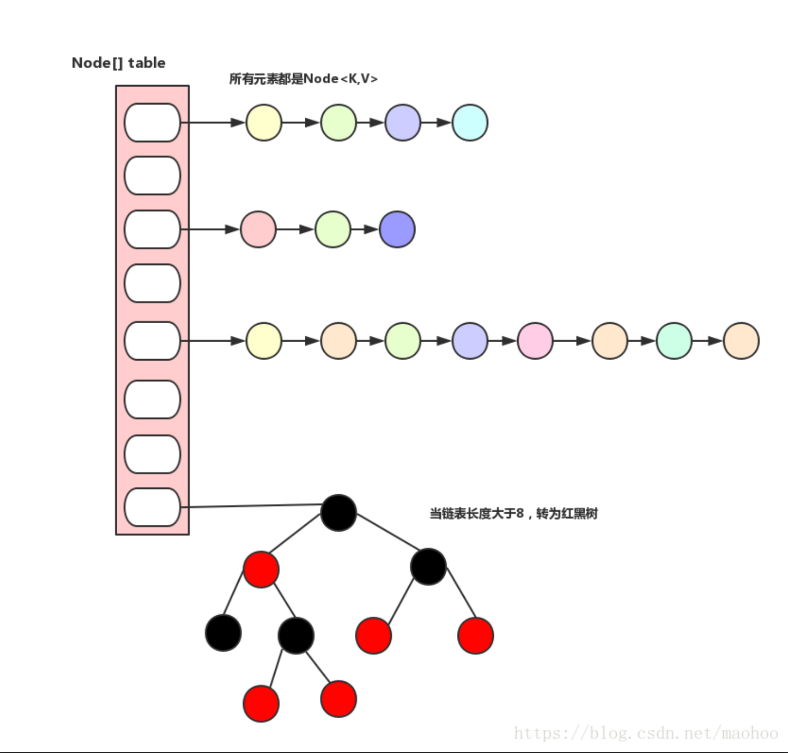

# 20210506-HashMap源码和JDK1.8以后的一些变化

## 内部实现

JDK1.8以后 HashMap的数据结构发生了一些改变,从单纯的数组加链表结构变成数组+链表+红黑树.如图



其中的Node是HashMap的静态内部类，实现了Map.Entry接口，本质就是一个KV映射，上图中的小圆圈就是一个Node

```java
static class Node<K,V> implements Map.Entry<K,V> {
    final int hash; // 用来定位数组索引位置
    final K key;
    V value;
    Node<K,V> next; // 链表的下一个node

    Node(int hash, K key, V value, Node<K,V> next) {
        this.hash = hash;
        this.key = key;
        this.value = value;
        this.next = next;
    }

    public final K getKey()        { return key; }
    public final V getValue()      { return value; }
    public final String toString() { return key + "=" + value; }

    public final int hashCode() {
        return Objects.hashCode(key) ^ Objects.hashCode(value);
    }

    public final V setValue(V newValue) {
        V oldValue = value;
        value = newValue;
        return oldValue;
    }

    public final boolean equals(Object o) {
        if (o == this)
            return true;
        if (o instanceof Map.Entry) {
            Map.Entry<?,?> e = (Map.Entry<?,?>)o;
            if (Objects.equals(key, e.getKey()) &&
                Objects.equals(value, e.getValue()))
                return true;
        }
        return false;
    }
}
```

具体的put方法的源码如下：

```java
final V putVal(int hash, K key, V value, boolean onlyIfAbsent,
               boolean evict) {
    Node<K,V>[] tab; Node<K,V> p; int n, i;
    // tab为空则创建
    if ((tab = table) == null || (n = tab.length) == 0)
        n = (tab = resize()).length;
    // 计算index，并对null做处理
    if ((p = tab[i = (n - 1) & hash]) == null)
        tab[i] = newNode(hash, key, value, null);
    else {
        Node<K,V> e; K k;
        // 节点key存在，直接覆盖原来的value
        if (p.hash == hash &&
            ((k = p.key) == key || (key != null && key.equals(k))))
            e = p;
         // 判断该链为红黑树   
        else if (p instanceof TreeNode)
            e = ((TreeNode<K,V>)p).putTreeVal(this, tab, hash, key, value);
       // 判断该链为链表
        else {
            for (int binCount = 0; ; ++binCount) {
                if ((e = p.next) == null) {
                    p.next = newNode(hash, key, value, null);
                    //链表长度大于8转换为红黑树进行处理
                    if (binCount >= TREEIFY_THRESHOLD - 1) // -1 for 1st
                        treeifyBin(tab, hash);
                    break;
                }
                // key已经存在直接覆盖原来的value
                if (e.hash == hash &&
                    ((k = e.key) == key || (key != null && key.equals(k))))
                    break;
                p = e;
            }
        }
        if (e != null) { // existing mapping for key
            V oldValue = e.value;
            if (!onlyIfAbsent || oldValue == null)
                e.value = value;
            afterNodeAccess(e);
            return oldValue;
        }
    }
    ++modCount;// modeCount字段主要用来记录HashMap内部结构发生变化的次数，主要用于迭代的快速失败
    if (++size > threshold)// size是指HashMap中实际存在的键值对数量；threshold是指允许的最大元素数目，超过这个数量，需要扩容（resize）
        resize();
    afterNodeInsertion(evict);
    return null;
}
```

当JVM存储HashMap的K-V时,仅仅通过Key来决定每一个Entry的存储槽位(Node[]中的index).并且Value以链表的形式挂载到对应槽位上即可(1.8之后如果长度大于8则转为红黑树).
HashMap之所以称之为HashMap是因为HashMap在put(String,Object)的时候JVM会对存入的对象进行一次hash(所有对象都是继承Object,而hashcode方法来自Object类中),从而获取到这个对象的hash值,接着JVM就根据这个hash值来决定该元素的存储位置.
如果发生两个Key存储到了同一个位置,则发生了Hash冲突(碰撞),Java采用的数组 + 链表方式就发挥作用了.Java采用链地址法(哈希值相同的元素构成一个链表,链表头指针指向Node[]的index),避免了Hash冲突的问题(参考上面的HashMap的图).Hash冲突发生后,这个槽位中存储的不是一个Entry而是多个Entry,此时就使用到了Entry链表(参见HashMap数据结构).JVM是按照顺序去遍历每一个Entry,一直到查找到对应的Entry为止(链表查询)

## HashMap的扩容机制

对应的resize()源码如下：

```java
 final Node<K,V>[] resize() {
    Node<K,V>[] oldTab = table; //当前所有元素所在的数组，称为老的元素数组
    int oldCap = (oldTab == null) ? 0 : oldTab.length; //老的元素数组长度
    int oldThr = threshold;	// 老的扩容阀值设置
    int newCap, newThr = 0;	// 新数组的容量，新数组的扩容阀值都初始化为0
    if (oldCap > 0) {	// 如果老数组长度大于0，说明已经存在元素
        // PS1
        if (oldCap >= MAXIMUM_CAPACITY) { // 如果数组元素个数大于等于限定的最大容量（2的30次方）
            // 扩容阀值设置为int最大值（2的31次方 -1 ），因为oldCap再乘2就溢出了。
            threshold = Integer.MAX_VALUE;	
            return oldTab;	// 返回老的元素数组
        }

       /*
        * 如果数组元素个数在正常范围内，那么新的数组容量为老的数组容量的2倍（左移1位相当于乘以2）
        * 如果扩容之后的新容量小于最大容量  并且  老的数组容量大于等于默认初始化容量（16），那么新数组的扩容阀值
			要么已经经历过了至少一次扩容）
        */
        else if ((newCap = oldCap << 1) < MAXIMUM_CAPACITY &&
                 oldCap >= DEFAULT_INITIAL_CAPACITY)
            newThr = oldThr << 1; // double threshold
    }

    // PS2
    // 运行到这个else if  说明老数组没有任何元素
    // 如果老数组的扩容阀值大于0，那么设置新数组的容量为该阀值
    // 这一步也就意味着构造该map的时候，指定了初始化容量。
    else if (oldThr > 0) // initial capacity was placed in threshold
        newCap = oldThr;
    else {               // zero initial threshold signifies using defaults
        // 能运行到这里的话，说明是调用无参构造函数创建的该map，并且第一次添加元素
        newCap = DEFAULT_INITIAL_CAPACITY;	// 设置新数组容量 为 16
        newThr = (int)(DEFAULT_LOAD_FACTOR * DEFAULT_INITIAL_CAPACITY); // 设置新数组扩容阀值为 16*0.75 = 12。0.75为负载因子（当元素个数达到容量了4分之3，那么扩容）
    }

    // 如果扩容阀值为0 （PS2的情况）
    if (newThr == 0) {
        float ft = (float)newCap * loadFactor;
        newThr = (newCap < MAXIMUM_CAPACITY && ft < (float)MAXIMUM_CAPACITY ?
                  (int)ft : Integer.MAX_VALUE);  // 参见：PS2
    }
    threshold = newThr; // 设置map的扩容阀值为 新的阀值
    @SuppressWarnings({"rawtypes","unchecked"})
        // 创建新的数组（对于第一次添加元素，那么这个数组就是第一个数组；对于存在oldTab的时候，
            那么这个数组就是要需要扩容到的新数组）
        Node<K,V>[] newTab = (Node<K,V>[])new Node[newCap];
    table = newTab;	// 将该map的table属性指向到该新数组
    if (oldTab != null) {	// 如果老数组不为空，说明是扩容操作，那么涉及到元素的转移操作
        for (int j = 0; j < oldCap; ++j) { // 遍历老数组
            Node<K,V> e;
            if ((e = oldTab[j]) != null) { // 如果当前位置元素不为空，那么需要转移该元素到新数组
                oldTab[j] = null; // 释放掉老数组对于要转移走的元素的引用（主要为了使得数组可被回收）
                if (e.next == null) // 如果元素没有有下一个节点，说明该元素不存在hash冲突
                    // PS3
                    // 把元素存储到新的数组中，存储到数组的哪个位置需要根据hash值和数组长度来进行取模
                    // 【hash值  %   数组长度】   =    【  hash值   & （数组长度-1）】
                    //  这种与运算求模的方式要求  数组长度必须是2的N次方，但是可以通过构造函数随意指定初始化容量呀，
                      如果指定了17,15这种，岂不是出问题了就？没关系，最终会通过tableSizeFor方法将用户指定的转化为大
                      于其并且最相近的2的N次方。 15 -> 16、17-> 32
                    newTab[e.hash & (newCap - 1)] = e;

                    // 如果该元素有下一个节点，那么说明该位置上存在一个链表了（hash相同的多个元素以链表的方式存储到
                        了老数组的这个位置上了）
                    // 例如：数组长度为16，那么hash值为1（1%16=1）的和hash值为17（17%16=1）的两个元素都是会存储
                        在数组的第2个位置上（对应数组下标为1），当数组扩容为32（1%32=1）时，hash值为1的还应该存储
                        在新数组的第二个位置上，但是hash值为17（17%32=17）的就应该存储在新数组的第18个位置上了。
                    // 所以，数组扩容后，所有元素都需要重新计算在新数组中的位置。


                else if (e instanceof TreeNode)  // 如果该节点为TreeNode类型
                    ((TreeNode<K,V>)e).split(this, newTab, j, oldCap);  // 此处单独展开讨论
                else { // preserve order
                    Node<K,V> loHead = null, loTail = null;  // 按命名来翻译的话，应该叫低位首尾节点
                    Node<K,V> hiHead = null, hiTail = null;  // 按命名来翻译的话，应该叫高位首尾节点
                    // 以上的低位指的是新数组的 0  到 oldCap-1 、高位指定的是oldCap 到 newCap - 1
                    Node<K,V> next;
                    // 遍历链表
                    do {  
                        next = e.next;
                        // 这一步判断好狠，拿元素的hash值  和  老数组的长度  做与运算
                        // PS3里曾说到，数组的长度一定是2的N次方（例如16），如果hash值和该长度做与运算，结果为0，就
                        说明该hash值一定小于数组长度（例如hash值为1），那么该hash值再和新数组的长度取摸的话，还是
                        hash值本身，所该元素的在新数组的位置和在老数组的位置是相同的，所以该元素可以放置在低位链表
                        中。
                        if ((e.hash & oldCap) == 0) {  
                            // PS4
                            if (loTail == null) // 如果没有尾，说明链表为空
                                loHead = e; // 链表为空时，头节点指向该元素
                            else
                                loTail.next = e; // 如果有尾，那么链表不为空，把该元素挂到链表的最后。
                            loTail = e; // 把尾节点设置为当前元素
                        }

                        // 如果与运算结果不为0，说明hash值大于老数组长度（例如hash值为17）
                        // 此时该元素应该放置到新数组的高位位置上
                        // 例：老数组长度16，那么新数组长度为32，hash为17的应该放置在数组的第17个位置上，也就是下标为
                        16，那么下标为16已经属于高位了，低位是[0-15]，高位是[16-31]
                        else {  // 以下逻辑同PS4
                            if (hiTail == null)
                                hiHead = e;
                            else
                                hiTail.next = e;
                            hiTail = e;
                        }
                    } while ((e = next) != null);
                    if (loTail != null) { // 低位的元素组成的链表还是放置在原来的位置
                        loTail.next = null;
                        newTab[j] = loHead;
                    }
                    if (hiTail != null) {  // 高位的元素组成的链表放置的位置只是在原有位置上偏移了老数组的长度个位置。
                        hiTail.next = null;
                        newTab[j + oldCap] = hiHead; // 例：hash为 17 在老数组放置在0下标，在新数组放置在16下标；    
                        hash为 18 在老数组放置在1下标，在新数组放置在17下标；                   
                    }
                }
            }
        }
    }
    return newTab; // 返回新数组
}
```

